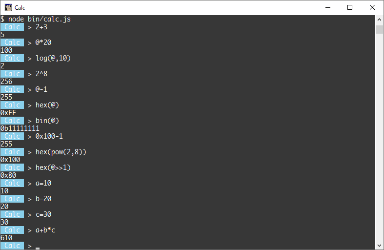

# cli-calc.js

Calculator for CLI with math.js



## Commands


| Command          | Function         |
|:-----------------|:-----------------|
| `exit` or `quit` | exit cli-calc.js |
| `ls`             | list values      |
| `history`        | show history     |
| `cls`            | clear display    |
| `clear`          | clear history    |

## Features

- Using math.js functions

```sh
Calc > round(sqrt(3))
2
Calc > ceil(sqrt(2))
2
```

- Reusing a previous result with `@`

```sh
Calc > 2+3
5
Calc > @*20
100
```

- Getting Hexadecimal/Binary string

```sh
Calc > hex(1194684)
0x123ABC
Calc > bin(12)
0b1100
```

- Using Hexadecimal/Binary with suffix `0x`/`0b`

```sh
Calc > 0xCAFE
51966
Calc > 0b1010
10
```

- Using SI prefixes

```sh
Calc > 1k
1000
Calc 1m
1000000
Calc > 1mm
0.001
Calc > 2m*1uu
2
```

**Case ignored**

|  Name | Symbol | Base 10 | Decimal                           |
|:-----:|:------:|:--------|:----------------------------------|
| yotta |    y   | 10^24   | 1 000 000 000 000 000 000 000 000 |
| zetta |    z   | 10^21   | 1 000 000 000 000 000 000 000     |
|  exa  |   ee   | 10^18   | 1 000 000 000 000 000 000         |
|  peta |    p   | 10^15   | 1 000 000 000 000 000             |
|  tera |    t   | 10^12   | 1 000 000 000 000                 |
|  giga |    g   | 10^9    | 1 000 000 000                     |
|  mega |    m   | 10^6    | 1 000 000                         |
|  kilo |    k   | 10^3    | 1 000                             |
| milli |   mm   | 10^-3   | 0.001                             |
| micro |   uu   | 10^-6   | 0.000 001                         |
|  nano |   nn   | 10^-9   | 0.000 000 001                     |
|  pico |   pp   | 10^-12  | 0.000 000 000 001                 |
| femto |   ff   | 10^-15  | 0.000 000 000 000 001             |
|  atto |   aa   | 10^-18  | 0.000 000 000 000 000 001         |
| zepto |   zz   | 10^-21  | 0.000 000 000 000 000 000 001     |
| yocto |   yy   | 10^-24  | 0.000 000 000 000 000 000 000 001 |

- Using temporary value

```sh
Calc > a=10
10
Calc > b=20
20
Calc > c=30
30
Calc > a+b*c
610
```

- User defined function

```sh
Calc > f(a,b)=a*2+b
f(a, b) = a * 2 + b
Calc > f(2,3)
7
```

- Copy & Paste

|                   |       |
|:-----------------:|:------|
| <kbd>Ctrl-C</kbd> | Copy  |
| <kbd>Ctrl-V</kbd> | Paste |
